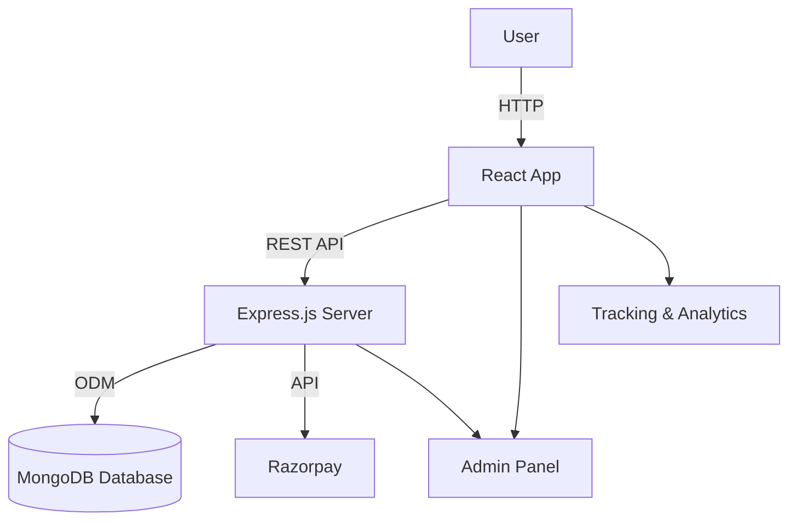

# RIVETO


---

## 🚀 Overview

**RIVETO** is a modern, fullstack web application built for scalability, advanced analytics, and seamless payment integration.  
It features a robust admin panel for management, user tracking, and advanced UI components.

---

## 🛠️ Tech Stack

- **Frontend:** React, Tailwind CSS
- **Backend:** Node.js, Express.js
- **Database:** MongoDB (Mongoose ODM)
- **Payments:** Razorpay Integration
- **Tracking:** Custom analytics & event tracking
- **UI:** Advanced, responsive design with Tailwind

---

## 🏗️ Architecture



---

## ⚙️ Features

- 📊 **Admin Panel:** Manage users, payments, analytics and more
- 💳 **Razorpay Integration:** Seamless and secure payment workflow
- 📈 **Advanced Tracking:** User behavior, transactions, and event analytics
- 🎨 **Modern UI:** Responsive, accessible, and beautiful interface (Tailwind)
- 🔐 **Authentication & Authorization:** Secure user and admin access
- 📝 **RESTful API:** Powerful backend for frontend and mobile clients

---

## 🚦 Quick Start

### 1. Clone the repository

```bash
git clone https://github.com/Nsanjayboruds/RIVETO.git
cd RIVETO
```

### 2. Set up the environment

- Copy and edit environment files:
  - For backend:  
    ```bash
    cp backend/.env.example backend/.env
    ```
  - For frontend:  
    ```bash
    cp frontend/.env.example frontend/.env
    ```
- Fill in your MongoDB, Razorpay keys, JWT secrets, etc.

### 3. Install dependencies

```bash
# In root
cd backend
npm install

cd ../frontend
npm install
```

### 4. Start development servers

```bash
# Backend (Node.js/Express)
cd backend
npm run dev

# Frontend (React)
cd ../frontend
npm start
```

- Backend: [http://localhost:5000](http://localhost:5000)
- Frontend: [http://localhost:3000](http://localhost:3000)
-ADMIN-PANEL [http://localhost:5174](http://localhost:3000)
---

## 🧪 Testing

```bash
# Backend
cd backend
npm test

# Frontend
cd ../frontend
npm test
```

---

## 📂 Project Structure

```
RIVETO/
├── backend/
│   ├── controllers/
│   ├── models/
│   ├── routes/
│   ├── middleware/
│   ├── services/
│   ├── .env.example
│   └── ...
├── frontend/
│   ├── src/
│   │   ├── components/
│   │   ├── pages/
│   │   ├── hooks/
│   │   ├── utils/
│   │   └── App.jsx
│   ├── public/
│   ├── .env.example
│   └── ...
├── README.md
└── ...
```

---

## 🛡️ Environment Configuration

### Backend (`backend/.env.example`)

```
MONGODB_URI=
JWT_SECRET=
RAZORPAY_KEY_ID=
RAZORPAY_KEY_SECRET=
BASE_URL=http://localhost:5000
```

### Frontend (`frontend/.env.example`)

```
REACT_APP_API_URL=http://localhost:5000/api
REACT_APP_RAZORPAY_KEY=
```

---

## 🎨 UI/UX

- Fully responsive admin panel
- Advanced dashboard with analytics charts
- Dark/light mode with Tailwind CSS
- Custom components for user and payment management

---

## 💳 Payments

- Razorpay checkout integrated for secure payments
- Payment status tracking and webhooks

---

## 📈 Tracking

- Custom event logging and analytics
- Admin dashboard for real-time tracking

---

## 📝 Contribution Guidelines

1. Fork the project
2. Create your feature branch (`git checkout -b feature/YourFeature`)
3. Commit your changes (`git commit -m 'Add feature'`)
4. Push to the branch (`git push origin feature/YourFeature`)
5. Open a Pull Request

Please review [CONTRIBUTING.md](CONTRIBUTING.md) for details.

---

## 🚀 Deployment

- **Docker Compose** and cloud deployment instructions coming soon!
- Easily deploy to [Vercel](https://vercel.com/) (frontend) and [Render](https://render.com/) or [Heroku](https://heroku.com/) (backend).

---

## 📝 License

MIT License. See [LICENSE](LICENSE) for details.

---

## 🙋‍♂️ Contact

- Nishant Sanjay Borude – [@Nsanjayboruds](https://github.com/Nsanjayboruds)

---

> _Built with React, Tailwind, Node.js, Express, MongoDB, and Razorpay_
